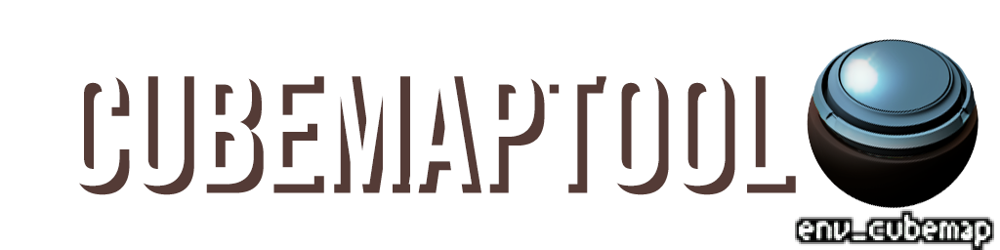

# [CLICK HERE TO DOWNLOAD](https://github.com/MrKleiner/cbtool/releases/latest)

## WHY:

Physically Based Rendering shader implementations that utilize cubemaps as their main source of specular
(thexa4, and all derrived works [Momentum Mod, Urban Chaos, Jabroni Brawl, etc.]), rely on cubemap mipmaps to simulate varying roughness levels.
However, Source hard-caps the mipmap levels at 32x32, not loading anything below.
This behaviour is avoidable by using a VTF flag, "No Minimum Mipmap".

The flag was added inside the PBR shader, but for some reason, the engine decided to ignore it, which means, shit sucks.

The best solution that was discovered, is to extract the cubemaps from inside the BSP using Pakrat/VIDE,
add the flag in VTFEdit, then import the VTFs back inside the BSP.

Fortunately, it works. Unfortunately, it fucking sucks.
This is where this tool comes in, automating this entire process, and even avoiding, like, all of the steps.
There are two versions of the tool:


## HOW:

```
1. CBT: CuBemapTool
The CuBemapTool is a GUI tool that let's you do exactly what is described above, to all .bsp files in a specified folder.
Just open the cbt_0.22.exe, and then give it the path to a folder with the desired bsp files.

Select the "No Minimal Mipmap" flag in the LEFT column, paste in the path 
(IMPORTANT: CTRL+V works only if the english keyboard is active),
and press the "SEX!" button (yes, seriously).

Wait until it finishes, observe the progress bar.
All affected BSP's should have a new "last modified" date on them.

2. BDSM: Better Dual Source Mapping (I have no clue, don't ask)
The BDSM (tool) is exactly the same thing, except it's a command line version of the tool, 
that's injected into the hammer compile pipeline, as the very last thing (could also be used as a standalone tool).

The idea here is to hit the compile button, and leave for tea, or other tasks that do not involve the devil's box.
Grab a snack! Do a few push ups! Touch grass! Start a fami-
```

### REQUIRED EXPERT MODE:
```
1. Add -autocubemap (Urban Chaos, Map Labs) or -buildcubemaps (All else) into parameters of $game_exe

2. Click NEW, the "command" field is the full path to the bdsm_0.29.exe, with file itself included, 
the "parameter" field should have "$bspdir\$file.$bsp".

3. Start compiling the map. The moment the VRAD is done, the game will open and compile the cubemaps for you. 
After it's done, the game will close autonomously.

4. The flag tool will automatically start after a few seconds, notifying you when it's done.
```


## NOTES:

* -autocubemap for UC will always compile only the HDR cubemaps, no matter the settings. This is not the case for Map Labs.
* -buildcubemaps does not have such functionality, which means cubemaps have to be built for all modes separately.
* The tool is using "advanced algorithms" (lmao) to detect HDR cubemaps. There's also an option to force-process every single VTF file in the bsp file, just in case.
* Low Mip levels (high roughness) have very noticable borders. This is not fixable, without divine intervention (Engine Code and Black Magic).
* You can reverse the flags by picking what you need to remove in the RIGHT column, in the GUI tool.


# CREDITS:

```
Mr.Kleiner:         Creating the tools
White_Red_Dragons:  Discovering the flag solution
roman_memes:        Discovering the issue, testing the tool, developing the workflow, writing this readme
```


Happy PBR'in!

```
$$$$$$$\  $$$$$$$\  $$$$$$$\  
$$  __$$\ $$  __$$\ $$  __$$\ 
$$ |  $$ |$$ |  $$ |$$ |  $$ |
$$$$$$$  |$$$$$$$\ |$$$$$$$  |
$$  ____/ $$  __$$\ $$  __$$< 
$$ |      $$ |  $$ |$$ |  $$ |
$$ |      $$$$$$$  |$$ |  $$ |
\__|      \_______/ \__|  \__|
```
